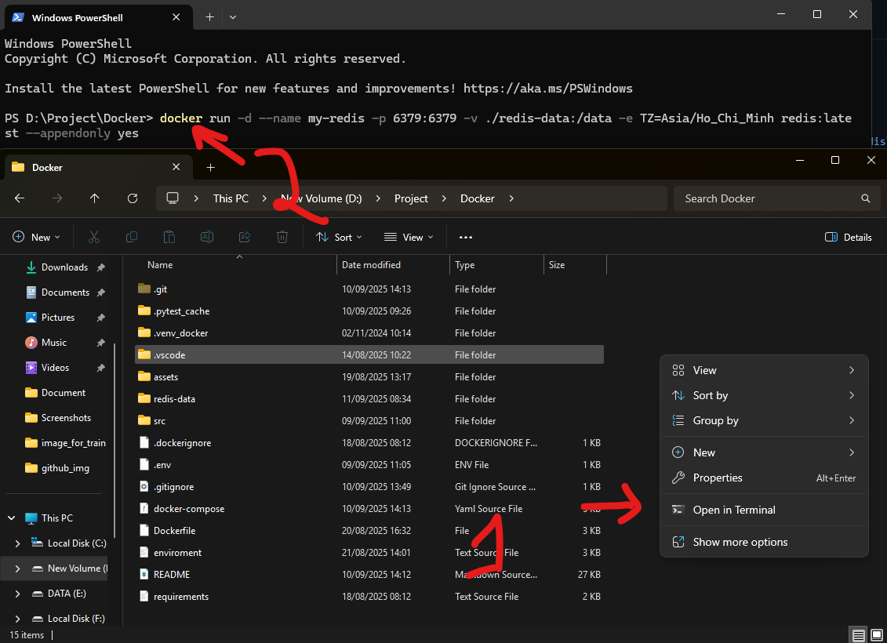

> [!NOTE]  
> ### Hướng dẫn sử dụng docker

# I.Docker Desktop

## 1. Cài đặt Docker Desktop
Đầu tiên ta cần tải và cài đặt `Docker Desktop` từ trang chủ của `Docker` [tại đây](https://www.docker.com/)  


Khi tải về cho máy tính thì sẽ cho ra tệp tin `Docker Desktop Installer` và ta khởi chạy tệp tin bằng cách click 2 lần vào tệp đó.  


Thêm các hình ảnh cài docker vào các bước phía dưới


## 2. Một số lỗi khi cài đặt
Dưới đây là một số lỗi xảy ra trong quá trình cài đặt `Docker Desktop`  

# II. Xây dựng phần mềm chạy với Docker  

## 1. Cấu trúc dự án
Để có thể chạy với `Docker` thì tất nhiên ta phải có phần mềm trước. Dưới đây là hướng dẫn ví dụ với phần mềm sử dụng `Python 3.12`, `Fast API`.  

Cấu trúc dự án như sau:  
```
Docker/
│
├── .venv_docker/                    # Môi trường ảo trong python (Tự sinh ra khi chạy câu lệnh tạo môi trường ảo của Python)
├── .vscode/                         # Cấu hình debug trong visual studio code (Tự sinh ra khi chạy Debug lần đầu, không cần tạo)
├── redis-data/                      # Thư mục để mount dữ liệu từ Redis ở Docker ra ngoài
├── src/
│   ├── main.py                      # Tệp chính chạy chương trình
│   ├── api/                         # Các router (endpoint)
│   │   ├── __init__.py
│   │   └── health_check.py
│   ├── auth/                        # Xác thực người dùng
│   │   ├── __init__.py
│   │   └── authentication.py
│   ├── controller/                  # Xử lý các api
│   │   ├── __init__.py
│   │   └── user_controller.py
│   ├── db/                          # Kết nối database
│   |   ├── __init__.py
│   |   └── database.py
│   ├── log/                         # Cấu hình ghi log
│   |   ├── __init__.py
│   |   └── api_log.py
│   ├── middleware/                  # middleware
│   │   ├── __init__.py
│   │   └── logger.py
│   ├── schemas/                     # Các schema để validation dữ liệu
│   │   ├── __init__.py              
│   │   └── user.py                  # Schema cho User
│   ├── security/                    # Cơ chế bảo vệ server
│   │   ├── __init__.py              
│   │   ├── config.py              
│   │   ├── keyspace.py              
│   │   ├── rate_limiter.py          # Kiểm soát truy cập bằng cách rate limit
│   │   └── redis_client.py          # Tạo kết nối tới Redis
│   ├── services/                    # Các dịch vụ khác
│   │   ├── __init__.py
|   |   └── mail_service.py          # Gửi mail
│   ├── test/                        # Các tệp test api
│   │   ├── __init__.py
|   |   └── file_api_test.py
|   └──utils/                        # Các hàm phụ trợ
|       ├── __init__.py
|       └── hash.py
│
├── requirements.txt                 # Danh sách package cần cài
├── .dockerignore                    # Cấu hình bỏ qua các thư mục, tệp trong docker
├── .env                             # Tệp tin chứa cấu hình các thông số
├── enviroment.txt                   # Hướng dẫn tạo tệp .env phù hợp với ứng dụng
├── .gitignore                       # Cấu hình bỏ qua các thư mục, tệp tin trong git
├── Dockerfile                       # Xây dựng các image cho docker
├── docker-compose.yml               # Cấu hình các thông số khi chạy trên docker
└── README.md
```

## 2. Tạo môi trường ảo 
Để dự án được xây dựng tốt nhất, ko tải các thư viện bừa bãi, cài thẳng vào máy tính thì ta sử dụng `môi trường ảo của python`.  

Chi tiết cách thức tạo môi trường ảo xem [tại đây](https://github.com/NguyenDucQuan12/virtual_environment_python)  
Chạy lệnh sau kiểm tra xem có python phiên bản 3.12 hay không.  
```python
py --list
```

Chạy lệnh tạo môi trường ảo sau:  
```python
py -3.12 -m venv .venv_docker --prompt="Docker API"
```

Sau đó kích hoạt môi trường ảo và cài đặt các thư viện cần thiết như sau:  
```python
python -m pip install -r requirements.txt  
```
Nếu thay đổi thư viện thì thêm vào tệp như sau:  
```python
python -m pip freeze > requirements.txt
```

## 3. Kết nối CSDL
Sử dụng `sqlalchemy` và `pydantic` để kết nối với `SQL Server`.  

```python
# Cài đặt SQLAlchemy để kết nối với SQL Server
pip install sqlalchemy

# Cài đặt Pydantic để sử dụng cho validation
pip install pydantic
```

Tạo kết nối với CSDL thông qua chuỗi kết nối được lấy từ biến môi trường (tệp .env):  

```python
# Cấu trúc chuỗi kết nối đến SQL Server
connection_url = URL.create(
    "mssql+pyodbc",
    username = os.getenv("DB_USER"), # Tên đăng nhập 
    password = os.getenv("DB_PASSWORD"), # mật khẩu đăng nhập
    host = os.getenv("DB_HOST") or "host.docker.internal" , # Địa chỉ IP của máy tính lấy được
    port = 1433, # cổng kết nối khi mở kết nối SQL server, xem them wor video youtube của bản thân
    database = os.getenv("DB_NAME"), # Tên của database cần truy cập
    query = {
        "driver": "ODBC Driver 18 for SQL Server", # Phiên bản driver của ODBC đã tải về từ microsoft
        "TrustServerCertificate": "yes"  
    },
)
```
> "driver": "ODBC Driver 18 for SQL Server"  
> Lưu ý, đối với driver ODBC thì lên trang chủ của Microsoft tải về theo từng phiên bản, nếu tải về phiên bản 17 thì thay đổi theo số phiên bản tương ứng  

Khi chạy trên `Docker` ta có thể lấy `SQL Server` tại host bằng chuỗi: `host.docker.internal`. Chuỗi này tương tự `localhost`.  
Chi tiết xem tại tệp [database](src/db/database.py)  

### 3.1 Tạo bảng trong CSDL
Lấy ví dụ với bảng `User_Login` trong CSDL.  

Đầu tiên cần định nghĩa bảng `User_Login` trong tệp [model](src/db/models.py):  
Các cột trong bảng `User_Login` được khai báo như bên dưới.  
```python
class DbUser_Login(Base):
    """
    Định nghĩa bảng thông tin đăng nhập   
    Mật khẩu đã được mã hóa trước khi lưu vào CSDL  
    """
    __tablename__ = "Users_Login"
    ID = Column(Unicode(200), primary_key=True)
    User_Name = Column(Unicode(500)) # Sử dụng kiểu Nvarchar: NVARCHAR
    Email = Column(Unicode(200), unique=True) # Không được trùng nhau
    Password = Column(Unicode(200))
    Avatar = Column(Unicode(400))
    Privilege = Column(Unicode(100))
    Activate = Column(DateTime)
    OTP_Code = Column(Unicode(100))
    Expiration_Time = Column(DateTime)
    Status = Column(Unicode(500))
```
Với 1 bảng được sử dụng trong SQLAchemy thì luôn yêu cầu `khóa chính`, vì vậy ta khai báo cột `ID` làm khóa chính.  

### 3.2 Tạo lược đồ cho bảng

Sau khi khai báo bảng `User_Login` ta sẽ tiến hành tạo các lược đồ `lấy thông tin từ người dùng` và lược đồ `trả về các thông tin cho người dùng`.  
Ví dụ với bảng `User_Login` có 10 cột, tuy nhiên khi đăng ký tài khoản mới ta chỉ cần người dùng cung cấp: `User_Name`,`Email`, `Password` và có thể thêm giá trị `ID` hoặc để `ID` là giá trị sinh ra random thì ko cần người dùng cung cấp.  
Còn khi ta hiển thị thông tin cho người dùng thì cũng chỉ hiển thị một số thông tin hạn chế, không nên hiển thị toàn bộ thông tin. Như khi người dùng đăng ký mới, người dùng cung cấp mật khẩu để đăng ký, tuy nhiên khi đăng ký thành công ta chỉ trả về cho người dùng `Họ tên`, `Email` của họ. Còn mật khẩu của họ thì chúng ta đã mã hóa, không trả về mật khẩu của họ.  

Vì vậy ta cần tạo ra các lược đồ tương ứng với mỗi yêu cầu tại tệp [schemas](src/schemas/schemas.py):  
```python
class User_Login_Base(BaseModel):
    """
    Class này chứa thông tin cần được cung cấp để tạo một thông tin đăng nhập mới
    - **ID**: Mã cho mỗi người đăng nhập
    - **User_Name**: Họ tên người đăng nhập 
    - **Email**: Email của người đăng nhập
    - **Password**: Mật khẩu người đăng nhập
    - **Avatar**: Đường dẫn tới hình ảnh người đăng nhập 
    - **Privilege**: Quyền hạn  
    """
    User_Name: str
    Email: str
    Password: str

class User_Login_Display(BaseModel):
    """
    Trả về thông tin người dùng theo ý muốn, không trả về những thông tin quan trọng như password đã hash
    Lưu ý tên của các trường thông tin trả về phải giống nhau, nếu không gặp lỗi
    -  **Config**: cho phép tự động chuyển đổi dữ liệu giữa CSDL (nvarchar) và kiểu mà ta đã khai báo (str)
    """
    User_Name: str
    Email: str
    Avatar:str
    Privilege: str
    class Config():
        from_attributes  = True
```

Ta có 2 lược đồ lấy thông tin người dùng và trả thông tin người dùng khi họ đăng ký tài khoản mới.  
Tùy vào nhu cầu mà có thể có nhiều lược đồ. Với các yêu cầu cần hiển thị các trường thông tin chi tiết hơn ta tạo 1 lược đồ hiển thị đầy đủ các thông tin cho người dùng như sau:  
```python
class User_Login_Full_Display(BaseModel):
    """
    Trả về đầy đủ các thông tin từ người dùng
    """
    ID = str
    User_Name = str
    Email = str
    Password = str
    Avatar = str
    Privilege = str
    Activate = datetime
    OTP_Code = str
    Expiration_Time = datetime
    Status = str
    class Config():
        from_attributes = True

class User_Login_OTP_Display (BaseModel):
    """
    Trả về các thông tin khi người dùng truy vấn mã OTP
    """
    ID = str
    User_Name = str
    Email = str
    OTP_Code = str
    Expiration_Time = datetime
```

> Các tên trong lược đồ và kết quả trả về phải trùng khớp với nhau (phân biệt chữ hoa chữ thường)  
> Như vậy thì lược đồ mới tự động chọn lọc các thông tin trùng nhau, bỏ các thông tin không cần thêm vào lược đồ  
> Đối với các dữ liệu trả về từ Databse thì tốt nhất nên đặt tên các trường trong lược đồ trùng tên với các cột trong Database  

### 3.3 Thực hiện truy vấn CSDL

Đối với các câu lệnh truy vấn tới CSDL, ta phân chia các câu lệnh thành các tệp truy vấn tương ứng với từng bảng. Ví dụ với bảng `User_Login` ta thực hiện tất cả các câu truy vấn tại tệp [db_user_login](src/db/db_user_login.py).  

Tại đây khi ta yêu cầu người dùng cung cấp các thông tin, ta có thể sử dụng các lược đồ đã tạo trước đó để người dùng có thể nhập thông tin tốt hơn, tránh nhập các thông tin ngoài lược đồ.  

```python
def create_new_user_login(db: Session, new_user_login: DbUser_Login):

    """
    Tạo người dùng mới vào CSDL
    - `new_user_login`: Thông tin người dùng mới cần thêm vào CSDL  
    """
    # Cú pháp trả về khi gọi CSDL
    response = {
        "success": False,
        "data": None,
        "message": "Lỗi khi thêm người dùng mới"
    }

    # Tiến hành ghi dữ liệu
    try:
        db.add(new_user_login)
        db.commit()
        # refresh giúp nhận được giá trị ID của người dùng, vì nó là giá trị tự tăng
        db.refresh(new_user_login)

        # Trả về kết quả thành công
        response["message"] = "Thêm người dùng mới thành công"
        response["success"] = True
        response["data"] = new_user_login

    except exc.IntegrityError as e:  # Bắt lỗi vi phạm ràng buộc (ví dụ: khóa chính, khóa ngoại)
        db.rollback()
        response["message"] = f"Lỗi khi thêm người dùng mới: Vi phạm ràng buộc dữ liệu ({str(e)})"
    
    except exc.DataError as e:  # Bắt lỗi kiểu dữ liệu không hợp lệ (ví dụ: vượt quá độ dài chuỗi, kiểu dữ liệu sai)
        db.rollback()
        response["message"] = f"Lỗi khi thêm người dùng mới: Lỗi dữ liệu ({str(e)})"
    
    except exc.SQLAlchemyError as e:  # Bắt tất cả các lỗi khác từ SQLAlchemy
        db.rollback()
        response["message"] = f"Lỗi khi thêm người dùng mới: {str(e)}"
    
    except Exception as e:  # Bắt tất cả các lỗi ngoài SQLAlchemy
        db.rollback()
        response["message"] = f"Lỗi không xác định: {str(e)}"        
    
    return response 
```
Luôn chạy các câu lệnh thao tác với CSDL vào khối `try-except` để xử lý tốt các trường hợp lỗi xảy ra.  

## 4. Tạo endpoint cho các api

Đối với mỗi api ta sẽ để vào thư mục [api](src/api), ví dụ với api: `user_login` có thể tham khảo tại tệp [user_login](src/api/user_login.py).  
Ta đặt tên tệp trùng với endpoint để tạo sự đồng nhất, dễ nhận biết và sửa lỗi sau này.  
Với mỗi endpoint ta cần khai báo tiền tố của endpoint đó.  
```python
# Khai báo router với tiền tố cho các endpoint là: /user_login/xxx
router = APIRouter(
    prefix = "/user_login",
    tags= ["User Login"]
)
```
Mặc định các endpoint sẽ được tự động thêm tiền tố `prefix` vào đầu các địa chỉ. Ví dụ: `http://172.31.99.130:8000/user_login/abc_enpoint`  

### 4.1 Các enpoint không cần xác thực người dùng (Non Authentication)
Với mỗi endpoint ta khai báo như sau:  
```python
@router.post("/new_user", response_model = User_Login_Display)
def create_user(request: User_Login_Base, db: Session = Depends(get_db)):
    """
    Tạo thông tin người dùng vào CSDL
    """
    return User_Login_Controller.create_user(db= db, request= request)
```
Đầu tiên cần nhận định phương thức của endponit này là thuộc các phương thức sau:  
- `get`: Lấy dữ liệu từ máy chủ và trả về  
- `put`: Ghi đè dữ liệu được gửi từ client lên máy chủ  
- `post`: Gửi thông tin tới máy chủ, thường là biểu mẫu dùng để đăng ký mới  
- `delete`: Xóa tài nguyên trên máy chủ  

Khi 1 api được khai báo với phương thức là `post` nhưng khi bạn sử dụng nó với phương thức khác như `get`, `delete`, ... thì sẽ nhận được lỗi `405 (Method not allowed)`.  

Sau đó tạo đường dẫn cho router này bằng 2 loại:  
- Tham số không nằm trong đường dẫn: là đường dẫn chỉ chứa các hằng số, ko chứa các biến  
Ví dụ: `"/new_user"`, `"/check_user/my_db"`, ...  
- Tham số nằm trong đường dẫn: Là đường dẫn mà trong đó chứa các tham số được người dùng truyền vào  
Ví dụ: `"/activate_user/{email_user}"`, `"/get_user/{department}"`, ...  

Ta có thể thêm tùy chọn `response_mode` là kiểu trả về cho người dùng. Khi ta muốn giới hạn tham số trả về cho người dùng, ẩn đi các tham số nhạy cảm như mật khẩu, token,... thì ta có thể sử dụng kiểu trả về như này, router mặc định chỉ giữa lại các tham số giống với lược đồ đã khai báo.  
Tham số của `response_mode` là một lược đồ đã được khai báo ở [schemas](src/schemas/schemas.py) và đã hướng dẫn chi tiết phía trên. Còn nếu không thêm tham số trả về này thì mặc định khi router trả về bất cứ cái gì thì nó sẽ giữ nguyên như vậy.  

Sau khi đã tạo router, ta tạo hàm xử lý cho router đó, mỗi khi có người gọi vào api thì hàm xử lý sẽ được chạy và trả về kết quả mong muốn.  
```python
def create_user(request: User_Login_Base, db: Session = Depends(get_db)):
```
Endpoint `/user_login/new_user` sẽ gọi hàm `create_user` với các tham số yêu cầu như sau:  
- `request`: tham số này tuân thủ theo lược đồ `User_Login_Base`  
- `db`: tham số này tuân thủ theo yêu cầu `Session` của Database và có hàm phụ thuộc `Depends(get_db)`. Hàm `Depends` có ý nghĩa là sẽ gọi hàm `get_db` trước khi chạy vào hàm `create_user` nhằm mục đích tạo kết nối tới CSDL trước khi chạy các câu lệnh khác.  

Sau đó hàm `create_user` gọi tới controller kiểm soát các hành vi của endpoint này.  

### 4.2 Các endpoint cần xác thực người dùng (Authentication)

Với một số endpoint bảo mật, không thể tùy ý cho bất cứ ai cũng sử dụng được. Ta cần xác thực người dùng, xem họ có quyền sử dụng api này hay không. Ví dụ với các thao tác như xóa dữ liệu, thay đổi dữ liệu ta nên hạn chế việc ai cũng có thể sử dụng api này. Vì vậy ta tạo ra một phương thức xác thực trước khi cho họ thao tác với api.  

Một api có xác thực người dùng được khai báo như sau:  
```python
@router.delete("/delete_user/{email_user}")
def delete_user(email_user: str, db: Session = Depends(get_db), current_user : UserAuth = Depends(get_info_user_via_token)):
    """
    Xóa tài khoản người dùng
    - `email_user`: Email của người dùng cần kích hoạt hoặc hủy kích hoạt
    """    
    return User_Login_Controller.delete_user(db= db, email_user= email_user, current_user = current_user)
```

Cũng tương tự như với các endpoint không cần xác thực người dùng về phương thức, hàm, ... chỉ có sự khác biệt là với hàm gọi khi thực hiện truy vấn api ta có thêm: `current_user : UserAuth = Depends(get_info_user_via_token)`.  
Trước khi người dùng được truy cập vào api ta phải xác thực người dùng trước đã, vì vậy ta có lệnh: `Depends(get_info_user_via_token)`, lệnh này sẽ gọi hàm `get_info_user_via_token` trước khi thực hiện hàm `delete_user`.  
Hàm `get_info_user_via_token` sẽ giải mã token và lấy thông tin người dùng được đính kèm vào token gọi là `payload`. Tất cả thông tin về người dùng sẽ được lưu vào biến `current_user`. Biến này sẽ được đưa vào controller và chịu trách nhiệm phân tích, xử lý, ...  

> Cách thức tạo token và xác thực có thể xem tại tệp [auth](src/auth/oauth2.py) và [authentication](src/auth/authentication.py)  

Khi người dùng gọi api này, bắt buộc họ phải truyền vào api một tham số xác thực là `header`. `Header` này chứa token như sau:  
```python
# Địa chỉ URL của API cần gọi
url = "http://172.31.99.130:8000/user_login/delete_user/{email_user}"

# Thông tin cần truyền vào (email_user)
email_user = "nguyenducquan2001@gmail.com"

# Thêm headers( token xác thực)
headers = {
    "Authorization": f"Bearer {my_token}"
}

# Gọi API 
response = requests.put(
    url = url.format(email_user=email_user),
    headers= headers
)
```
### 4.3 Tạo controller xử lý các endpoint

Sau khi tạo endpoint và các hàm xử lý khi api được gọi, để code rõ ràng, nhìn đẹp mắt, sau này cũng dễ sửa chữa, nâng cấp thì các thao tác khi người dùng gọi api sẽ được xử lý ở một trung gian kết nối tất cả (Database, authentication, cilent, ...) là `Controller`.  

Các controller được đặt tại thư mục [controller](src/controllers). Mỗi controller sẽ được đặt tên trùng với api để dễ dàng nhận biết controller này chịu trách nhiệm xử lý cho api nào.  
Với controller của `user_login` ta có thể tham khảo tại [user_login_controller](src/controllers/user_login_controller.py)  

Khi gọi api tạo người dùng mới tại địa chỉ: ` http://172.31.99.130:8000/user_login/new_user`. Api này sẽ gọi tới hàm `create_user` và hàm `create_user` sẽ gọi tới controller để xử lý như sau:  

```python
def create_user(request: User_Login_Base, db: Session):
    """
    Tạo thông tin người dùng mới
    """
    # Tạo id ngẫu nhiên cho một người
    new_user_id = get_random_string(32)

    # Validate các thông tin người dùng mới
    if not request.User_Name or not request.Email or not request.Password:
        raise HTTPException(
            status_code=status.HTTP_400_BAD_REQUEST,
            detail={
                "message": "Tên người dùng, email và mật khẩu là bắt buộc"
            }
        )
    
    # Kiểm tra email là hợp lệ
    if not re.match(EMAIL_REGEX, request.Email):
        raise HTTPException(
            status_code=status.HTTP_400_BAD_REQUEST,
            detail={
                "message": f"Email {request.Email} không hợp lệ"
            }
        )
    
    # Ép các giá trị sang kiểu chuỗi
    user_name = str(request.User_Name)
    email = str (request.Email)
    password = str(request.Password)

    # Kiểm tra email đã tồn tại trên CSDL chưa
    existing_user = db_user_login.get_user_login_by_email(db= db, email= email)

    if existing_user["success"]:
        raise HTTPException(
            status_code=status.HTTP_400_BAD_REQUEST,
            detail={
                "message": f"Email {request.Email} đã được sử dụng. Hãy lựa chọn tài khoản khác."
            }
        )
    elif existing_user["success"] is False:
        raise HTTPException(
            status_code=status.HTTP_500_INTERNAL_SERVER_ERROR,
            detail={
                "message": f"Xảy ra lỗi trong quá trình tạo người dùng {request.Email}: {existing_user['message']}"
            }
        )
    else:
        # Khai báo các thông tin cho người dùng mới
        new_user_login =  DbUser_Login(
            ID = new_user_id, 
            User_Name = user_name,
            Email = email,
            Password = Hash.bcrypt(password), # mã hóa mật khẩu
            Avatar = DEFAULT_AVATAR,
            Privilege = DEFAULT_PRIVILEGE
        )

        # Gọi hàm để thêm người dùng mới vào CSDL
        new_user = db_user_login.create_new_user_login(db=db, new_user_login=new_user_login)  

        # Kiểm tra kết quả trả về từ hàm tạo người dùng mới
        if not new_user["success"]:
            raise HTTPException(
                status_code=status.HTTP_500_INTERNAL_SERVER_ERROR,
                detail={
                    "message": new_user["message"]
                }
            ) 

    return new_user["data"]
```

Ta nhận vào `request: User_Login_Base` là thông tin được yêu cầu người dùng nhập vào tuân theo lược đồ `User_Login_Base`.  
Khi nhận được thông tin từ người dùng, ta cần phải xác thực lại tất cả thông tin từ người dùng, bởi vì nếu không cẩn thận, người dùng đưa thông tin sai sẽ khiến cho CSDL gặp trục trặc, có thể bị tấn công, ...  

Đối với các hàm yêu cầu xác thực người dùng ta cần kiểm tra xem người đang gọi api là ai và quyền của họ có bao gồm chức năng đang thực hiện hay không:  
```python
# Kiểm tra xem có quyền thao tác không
if not current_user:
    raise HTTPException(
        status_code=status.HTTP_403_FORBIDDEN,
        detail={
            "message": "Vui lòng xác thực người dùng trước khi thao tác"
        }
    )

if current_user["Privilege"] not in HIGH_PRIVILEGE_LIST:
    raise HTTPException(
        status_code=status.HTTP_403_FORBIDDEN,
        detail={
            "message": "Bạn không có quyền xóa tài khoản người dùng"
        }
    )
```

# III. Cách viết Docker File

Trong dự án của ta có tệp tin là `Dockerfile`, nó sẽ có hình con cá voi.  

  

## 1. Cấu hình Dockerfile 

Đầu tiên ta tạo 1 tệp `Requirements.docker.txt`, tệp này chỉ chứa các gói cần thiết cho dự án khi được sử dụng trong `Docker` tránh khi sử dụng `python -m pip freeze > requirements.txt` kéo hàng trăm gói nặng khác mà không cần thiết.  

Ví dụ 1 tệp nhưu sau:  
```Dockerfile
# ===== Web API =====
fastapi==0.128.0
uvicorn[standard]==0.40.0
python-multipart==0.0.21
orjson==3.11.5
python-dotenv==1.2.1

# ===== Redis / Job Queue (RQ) =====
redis==7.1.0
rq==2.6.1

# ===== OCR / PDF / Image =====
paddleocr==3.3.2
paddlex==3.3.12
opencv-contrib-python==4.10.0.84
pillow==11.2.1
pypdfium2==5.2.0

# ===== logging/monitor =====
psutil==7.1.3
......
```
Với các thư viện cài khác, không sử dụng `pip install xxx` thì không thêm vào tệp này.  

Sau đó tạo `.dockerignore` để không phá cache build.  
```dockerfile
# Thư mục venv
.venv

# Các tệp được tạo ra khi chạy dự án
__pycache__/
*.pyc

# Git
.git/
.gitignore

# data/models là bind-mount runtime, không copy vào image
data/
models/

# logs/output runtime
output/
logs/
uploads/

```

### 1.1 Hướng DEV

Trong quá trình viết code, ta luôn thay đổi các tệp tin code, còn các thư viện không thay đổi thường xuyên thì ta sẽ làm như sau:  
Tạo 1 tệp `Dockerfile.dev`, tệp tin này chịu trách nhiệm tải các thư viện. Nếu thay đổi thư viện thì lúc đó ta sẽ chạy lại từ đầu, còn nếu không thay đổi các thư viện thì không cần.  

Mẫu `Dockerfile` như sau:  
```Dockerfile
# ========= Base image (Python 3.12 slim) =========
FROM python:3.12-slim

# ========= ENV cơ bản =========
# PYTHONDONTWRITEBYTECODE: không tạo file .pyc -> gọn, tránh rác
# PYTHONUNBUFFERED: log ra stdout ngay (docker logs thấy realtime)
# PIP_DISABLE_PIP_VERSION_CHECK: giảm noise khi install
ENV PYTHONDONTWRITEBYTECODE=1 \
    PYTHONUNBUFFERED=1 \
    PIP_DISABLE_PIP_VERSION_CHECK=1

# ========= Thư mục làm việc trong container =========
WORKDIR /app

# ========= Cài gói hệ thống =========
# build-essential: cần nếu có gói phải compile (vd pyodbc)
# curl/ca-certificates/gnupg: để add repo Microsoft ODBC
# libgl1/libglib2.0-0: OpenCV/Pillow thường cần
# libgomp1/libstdc++6: hay cần để import Paddle core (libpaddle.so) ổn định trên slim
# Cần cái nào thì cài cái đó, ko cần cái nào thì xóa dòng đó
RUN apt-get update && apt-get install -y --no-install-recommends \
    build-essential \
    curl \
    ca-certificates \
    gnupg \
    libgl1 \
    libglib2.0-0 \
    libgomp1 \
    libstdc++6 \
  && rm -rf /var/lib/apt/lists/*

# ========= Cài ODBC Driver 18 + unixODBC (nếu dùng pyodbc để kết nối tới SQL Server) =========
RUN curl -fsSL https://packages.microsoft.com/keys/microsoft.asc | gpg --dearmor -o /usr/share/keyrings/ms-prod.gpg && \
    echo "deb [arch=amd64,arm64 signed-by=/usr/share/keyrings/ms-prod.gpg] https://packages.microsoft.com/debian/12/prod bookworm main" > /etc/apt/sources.list.d/msprod.list && \
    apt-get update && \
    ACCEPT_EULA=Y apt-get install -y --no-install-recommends msodbcsql18 unixodbc-dev && \
    rm -rf /var/lib/apt/lists/*

# ========= Tạo user non-root =========
RUN groupadd -g 1000 app && \
    useradd -m -u 1000 -g app -s /usr/sbin/nologin app

# ========= Dependency layer (tối ưu cache) =========
# Copy requirements.docker.txt vào image.
# Khi bạn chỉ sửa code, file này không đổi => Docker dùng cache => không cài lại libs nặng.
COPY requirements.docker.txt /app/requirements.docker.txt

# Nâng pip tooling trước
RUN pip install --upgrade pip setuptools wheel

# Cài PaddlePaddle GPU CUDA 11.8 bằng index cu118 (theo hướng dẫn chính thức).
RUN python -m pip install paddlepaddle-gpu==3.2.2 -i https://www.paddlepaddle.org.cn/packages/stable/cu118/
# Cài đặt safetensors đối với dùng PaddleOCR
RUN python -m pip install https://paddle-whl.bj.bcebos.com/nightly/cu126/safetensors/safetensors-0.6.2.dev0-cp38-abi3-linux_x86_64.whl

# Cài các gói còn lại (API/RQ/OCR/PDF…) nằm trong tệp requirements
RUN pip install -r /app/requirements.docker.txt

# ========= PYTHONPATH để import theo kiểu "from config import ..." =========
# Thư mục src trong dự án chứa toàn bộ code
ENV PYTHONPATH=/app/src

# ========= Tạo sẵn thư mục runtime và gán quyền =========
RUN install -d -o app -g app /app/uploads /app/log/api_log /app/log/system_log

# Chạy bằng user app
USER app

# Mở cổng API
EXPOSE 8000

# DEV: không COPY code ở đây.
# Code sẽ được bind-mount từ host bằng docker-compose.
# Lệnh chạy sẽ đặt trong docker-compose (để bật --reload).
```

Image này sẽ chứa toàn bộ thư viện mà ta sử dụng (Paddle GPU, OCR lib, ODBC, ...). Sau đó tệp `docker-compose.dev.yaml` sẽ `mount` thư mục chứa code vào container, khi nào ta sử code trên máy tính là container thấy ngay, tự động cập nhật code mới.  

Đây là tệp `docker-compose.dev.yaml` mẫu:  
``` Dockerfile
services:
  # ===== Redis: nơi lưu job queue + metadata =====
  redis:
    image: redis:7-alpine
    ports:
      - "6379:6379"           # expose để debug local (có thể bỏ trong production)
    healthcheck:
      test: ["CMD", "redis-cli", "ping"]   # container healthy khi ping OK
      interval: 3s
      timeout: 1s
      retries: 10

  # ===== API service =====
  api:
    build:
      context: .              # build từ thư mục dự án hiện tại
      dockerfile: Dockerfile.dev
    env_file: .env
    ports:
      - "8000:8000"
    environment:
      - PYTHONPATH=/app/src
      # cache/model của Paddle/PaddleX -> mount vào /app/models để giữ qua lần chạy
      - PADDLE_PDX_CACHE_HOME=/app/models
      # (khuyên) timezone nếu app bạn cần
      - TZ=Asia/Ho_Chi_Minh
    volumes:
      # bind-mount code: sửa code là chạy ngay, không build lại
      - ./src:/app/src
      - ./worker:/app/worker

      # giữ model/cache để không tải lại
      - ./models:/app/models

      # giữ input/output job (status/result/export images)
      - ./data:/data

    depends_on:
      redis:
        condition: service_healthy

    # DEV: uvicorn reload (main.py nằm trong /app/src, và PYTHONPATH đã trỏ /app/src)
    command: ["bash", "-lc", "uvicorn main:app --host 0.0.0.0 --port 8000 --reload"]

  # ===== Worker (multi-gpu) =====
  worker:
    build:
      context: .
      dockerfile: Dockerfile.dev
    env_file: .env
    environment:
      - PYTHONPATH=/app/src
      - PADDLE_PDX_CACHE_HOME=/app/models
      - TZ=Asia/Ho_Chi_Minh
    volumes:
      - ./src:/app/src
      - ./worker:/app/worker
      - ./models:/app/models
      - ./data:/data
    depends_on:
      redis:
        condition: service_healthy
    gpus: all                 # cấp GPU vào container (yêu cầu NVIDIA Container Toolkit)
    command: ["bash", "-lc", "python /app/worker/worker_multi_gpu.py"]
```

Và cách chạy như sau:  
Khi ta chạy lần đầu hoặc thay đổi Dockerfile, requirement (liên quan đến các thư viện đang sử dụng):  
Cài đặt các thư viện cần thiết  
```Docker
docker compose -f docker-compose.dev.yml build
```
Sau đó khởi chạy  
```Docker
docker compose -f docker-compose.dev.yml up -d
```
Đối với API thì khi đổi code nó có chức năng tự reload nên ta ko cần chạy lại, còn các worker thì ta cần restart lại là được. Vi vậy với việc cập nhật, chỉnh sửa code ta chạy như sau cho 1 worker:  
```Docker
docker compose -f docker-compose.dev.yml restart worker
```
### 1.2 Hướng Production

Trong production, thường không bind-mount code (để triển khai ổn định). Nhưng vẫn muốn:  
- layer dependency cache (không cài lại Paddle GPU - các thư viện nặng, ít thay đổi)  
- model/cache và data vẫn mount ngoài để không mất.  

Giải pháp: Dockerfile multi-stage theo kiểu “deps -> runtime” (nhưng runtime vẫn dựa trên deps để giữ ODBC libs và site-packages).

Ta sẽ viết tệp `Dockerfile` tương tự như mẫu hoàn chỉnh dưới đây.  

```Dockerfile
# ========= Chọn phiên bản Python phù hợp với dự án (slim cho nhẹ, tuy nhiên nó sẽ thiếu nhiều thư viện hệ thống) =========
FROM python:3.12-slim AS base

# ========= ENV cơ bản =========
# - Không tạo .pyc
# - Log đi thẳng ra stdout (không buffer)
# - Không lưu cache pip (image nhẹ)
ENV PYTHONDONTWRITEBYTECODE=1 \
    PYTHONUNBUFFERED=1 \
    PIP_NO_CACHE_DIR=1

# ========= Cài gói hệ thống cần thiết =========
# - build-essential: biên dịch một số lib Python (vd: pyodbc)
# - curl, ca-certificates, gnupg: để thêm repo Microsoft và xác thực
# - libgl1: hỗ trợ các backend liên quan hiển thị/ảnh (OpenCV hay cần)
# - libglib2.0-0: dependency phổ biến để tránh lỗi runtime thiếu lib
# ...
# Sau khi cài xong, xóa cache apt để giảm size image (&& rm -rf /var/lib/apt/lists/*)
RUN apt-get update && apt-get install -y --no-install-recommends \
    build-essential \
    curl \
    ca-certificates \
    gnupg \
    && rm -rf /var/lib/apt/lists/*

# ========= Cài ODBC Driver 18 + unixODBC cho SQL Server =========
# Mặc định linux khi sử dụng thư viện msslq thì ko cần phải cài thêm driver hay gì thêm
# Khi sử dụng pyodbc thì cần driver ODBC, mà trong linux không có driver ODBC nên ta sẽ cài ODBC phiên bản 18 (Sửa code khi kết nối sử dụng ODBC driver phiên bản 18)

RUN curl -fsSL https://packages.microsoft.com/keys/microsoft.asc | gpg --dearmor -o /usr/share/keyrings/ms-prod.gpg && \
    echo "deb [arch=amd64,arm64 signed-by=/usr/share/keyrings/ms-prod.gpg] https://packages.microsoft.com/debian/12/prod bookworm main" > /etc/apt/sources.list.d/msprod.list && \
    apt-get update && \
    ACCEPT_EULA=Y apt-get install -y --no-install-recommends msodbcsql18 unixodbc-dev && \
    rm -rf /var/lib/apt/lists/*

# ========= Tạo user non-root (an toàn hơn) =========
# Không nên chạy với quyền root (Cao nhất) tránh các thao tác không đáng có, luôn hạn chế quyền
# - Cố định UID/GID = 1000 giúp bind-mount từ host Linux đỡ vướng quyền
RUN groupadd -g 1000 app && \
    useradd -m -u 1000 -g app -s /usr/sbin/nologin app

# ========= Thư mục làm việc mặc định trong container =========
WORKDIR /app

# =========  Thường các thư viện GPU sẽ ko có trên PyPI, và tải bằng câu lệnh riêng ======================
# Xóa các thư viện này ở trong requirements, vì nó sẽ được cài riêng (ví dụ: paddlepaddle-gpu, ...)
# Nâng setuptools/wheel để giảm lỗi build wheel
# Cài PaddlePaddle GPU đúng CUDA 11.8 bằng index chính thức (cu118)
# Sau đó mới cài phần còn lại từ requirements.txt
# RUN python -m pip install --upgrade setuptools wheel \
#     && python -m pip install paddlepaddle-gpu==3.2.2 -i https://www.paddlepaddle.org.cn/packages/stable/cu118/ 

# =========  Copy tệp requirements và cài đặt thư viện theo layer cache =========
COPY requirements.txt /app/requirements.txt
RUN pip install --upgrade pip && pip install -r /app/requirements.txt

# ========= Copy code vào container =========
# --chown đảm bảo code thuộc về user "app", own là owner
COPY --chown=app:app . /app

# Chuyển đổi thời gian trong container về múi giờ Vietnam (UTC+7)
RUN ln -sf /usr/share/zoneinfo/Asia/Ho_Chi_Minh /etc/localtime \
    && echo "Asia/Ho_Chi_Minh" > /etc/timezone

# Tạo sẵn thư mục uploads và gán quyền
RUN install -d -o app -g app /app/uploads /app/update_application /app/log/api_log /app/log/system_log

# Chạy dưới user vừa tạo (app)
USER app

# ========= Mở cổng ứng dụng =========
EXPOSE 8000

# ========= Lệnh khởi động =========
CMD ["fastapi", "run", "src/main.py", "--port", "8000"]
```

# IV. Khởi chạy phần mềm  

Để chạy bằng `Docker` thì đầu tiên ta sẽ khởi động ứng dụng `Docker` trên máy tính. Nếu chưa có thì tiến hành tải `Docker` từ trang chủ về trước.

## 1. Khởi chạy với docker compose
Docker compose là một tệp tin cấu hình các thông số của dự án để chạy trên ứng dụng `Docker`. Phương pháp này tối ưu và tiện dụng nhất cho môi trường làm việc.  

### 1.1 Khởi động đồng thời hai service

Tệp tin `docker-compose.yml` hiện tại đang khai báo 2 dịch vụ (service) là `Redis` cho mục đích cache, `API` là dự án chính của chúng ta. Ta cần cả 2 dịch vụ này hoạt động song song nhau. Có một cách thức để khởi chạy 2 dịch vụ này cùng lúc như sau:  
Mở terminal tại dự án (nơi đặt tệp `docker-compose.yml`) và chạy lệnh:  
```docker
docker compose up --build -d
```

Trong tệp cấu hình có điều kiện: `depends_on: - redis` đảm bảo khởi động Redis trước rồi tới API. Tuy nhiên nó chỉ đảm bảo thứ tự khởi động trước và sau, còn Redis khởi động trước nhưng chưa sẵn sàng truy cập thì vẫn gặp lỗi. Đã thêm `condition` để đợi Redis khởi động xong thì mới chạy `Docker_API`.  
Có thể kiểm tra nhanh như sau:  
```docker
docker compose ps
docker compose logs -f redis
docker compose logs -f docker_api
```

### 1.2 Chỉ khởi động 1 service
Khi ta phát triển hệ thống, không tránh khỏi việc có lỗi, vì vậy ta cần sửa lỗi và sau khi sửa lỗi xong thì khởi động lại dịch vụ api. Tuy nhiên ta không nên tắt cả 2 dịch vụ và lại khởi động lại cả 2 dịch vụ. Ta có thể tắt mỗi dịch vụ API và khởi động lại nó như sau.  
Dừng dịch vụ `API` và giữ dịch vụ `Redis` vẫn hoạt động:  
```docker
docker compose stop docker_api
```
Trong đó `docker_api` là tên dịch vụ mà ta khai báo trong `docker-compose.yml`.  

Khi lỡ tắt dịch vụ mà ta muốn chạy hoặc khởi động lại thì làm như sau, dành cho việc code ko thay đổi, thì dịch vụ này ko cần xây dựng (build) lại:  
```docker
docker compose start docker_api
# hoặc
docker compose restart docker_api
```
Nếu ta sửa đổi code, có nghĩa là tạo ra 1 phiên bản mới cho dịch vụ API thì ta cần build lại container, container mới này chứa các code mới:  
```docker
docker compose up -d --no-deps --build docker_api
```
Trong đó:  
- `-d` là chạy nền trên ứng dụng `Docker` mà không hiển thị log ra terminal  
- `--no-deps` không khởi động lại dịch vụ phụ thuộc (Redis)
- `--build` là xây dựng lại image cho container (Do đã thay đổi code)  

Ta có thể kiểm tra log như sau:  
```docker
docker compose logs -f docker_api
```

## 2. Khởi chạy bằng terminal
Ta có thể khởi chạy phần mềm bằng terminal trong `Visual studio code` hoặc chính terminal tại thư mục chứa dự án.  
Với VSCode, ta mở thư mục dự án và mở terminal của dự án ra. Kích hoạt môi trường ảo (nếu có).  


Vì dự án của chúng ta sử dụng cache của `Redis` giúp cho chúng ta truy vấn một số api thường xuyên, liên tục nhanh hơn, không phải truy vấn vào `Database` để lấy dữ liệu liên tục khi mà dữ liệu không có sự thay đổi. Vì vậy ta cần chạy 2 dịch vụ để hoàn tất quá trình khởi chạy dự án.  

### 2.1 Khởi chạy Redis

`Redis` được chạy trên `docker desktop` với câu lệnh sau vào terminal:  
```docker
docker run -p 6379:6379 -it redis:latest
```
Nó sẽ lấy phiên bản mới nhất của `Redis` và khởi chạy, như vậy là hoàn tất khởi chạy `Redis`. Tuy nhiên để ta sẽ chạy một câu lệnh chi tiết hơn như sau:  
```docker
docker run -d --name my-redis -p 6379:6379 -v ./redis-data:/data -e TZ=Asia/Ho_Chi_Minh redis:latest --appendonly yes
```


Hoặc mở terminal tại thư mục dự án và chạy như sau  



Trong đó:  
- `-d`: Chạy nền dịch vụ trong `Docker Desktop`  
- `--name: my-redis`: Đặt tên cho container là `my-redis`  
- `-p 6379:6379`: Gán port 6379 từ docker ra port 6379 bên ngoài để có thể truy cập được  
- `-v ./redis-data:/data`: Bind mount (sao chép dữ liệu) từ thư mục `data` trong `Docker` ra thư mục `redis-data` trên máy tính  
- `-e TZ=Asia/Ho_Chi_Minh`: Biến môi trường lấy thời gian trong docker theo múi giờ VN  
- `redis:latest`: Truy cập phiên bản mới nhất của `Redis` trên hệ thống `Docker`  
- `--appendonly yes`: Cho phép dữ liệu ghi từ Redis được chép vào tệp tin. Điều này giúp ta copy thư mục data mới thành công. Bởi nếu ko chép dữ liệu ra tệp tin thì không có tệp tin nào để chép vào thư mục `redis-data`


Sau đó mở `Docker Desktop` lên thấy dịch vụ `Redis` đang chạy ở mục container như hình thì là đã hoàn thành.  

### 2.2 Khởi chạy docker_api
Sau khi dịch vụ cache được khởi chạy thành công thì ta tiến hành chạy dịch vụ api của chúng ta. Có 3 cách để chúng ta khởi chạy dịch vụ api này.  
#### Sử dụng VSCode làm máy chủ để chạy hệ thống
Cả 2 lệnh bên dưới đều được giới thiệu tại trang chủ của `FastAPI`, nếu sau này chạy lỗi, vào trang chủ `FastAPI` để xem lại lệnh mới.  

```python
fastapi dev src/main.py
```
Với lệnh này ta sẽ tiến vào chế độ phát triển, khi ta thay đổi code hay chỉnh sửa gì thì máy chủ api sẽ tự động khởi động lại để cập nhật những code mới. Cách này rất hữu ích trong việc phát triển, vì chúng ta thay đổi, cập nhật code thường xuyên.  

```python
fastapi run src/main.py
```
Còn với lệnh này thì ta sẽ lấy máy hiện tại làm máy chủ để cho các máy khác truy cập vào api của chúng ta thông qua ip.  


#### Sử dụng Docker Desktop làm máy chủ (Khuyến nghị sau khi phát triển xong)
Thay vì sử dụng VSCode để chạy FastAPI thì ta sử dụng `Docker Desktop` sẽ tốt hơn, vì nó có các dịch vụ hỗ trợ vận hành cực kỳ tốt.  
Sử dụng Docker Desktop thì ta chạy với tệp tin `docker-compose.yml` như hướng dẫn ở phần I

# IV. Đẩy image Docker lên Docker Hub

Ta có thể chia sẻ các image cho nhau thông qua `Docker Hub`. Đây là nơi các `image` được lưu trữ, mỗi người dùng bình thường sẽ chỉ có 1 `image` chế độ `Private`, còn lại đều phải `public`.  


Sau đó truy cập vào tab `Repositories`, đây là nơi lưu trữ các dự án của bản thân.  


Tại đây ta sẽ tạo các `repositories` ban đầu. Nó sẽ được dùng cho lưu trữ dự án. Ta sử dụng chức năng `create repository` để tạo 1 dự án mới.  


Ta đặt tên cho dự án mới và viết mô tả về dự án này, sau đó chọn chế độ hiển thị cho dự án là `public` hoặc `private`. Sau đó ấn `Create` là hoàn thành.  

Ở đây `Docker Hub` có gợi ý kết nối tới dự án như sau:  

```docker
docker tag local-image:tagname new-repo:tagname
docker push new-repo:tagname
```

Tuy nhiên mình sẽ sử dụng phương pháp khác.  

Đầu tiên ta cần đăng nhập vào `Docker Desktop` bằng nút `Login` trên phần mềm hoặc sử dụng `CLI` gõ lệnh sau để đăng nhập:  
```bash
docker login
```
Ví dụ:  
```bash
(PaddleOCR) PS D:\Project\PaddleOCR> docker login

USING WEB-BASED LOGIN

i Info → To sign in with credentials on the command line, use 'docker login -u <username>'


Your one-time device confirmation code is: NHPQ-MCSX
Press ENTER to open your browser or submit your device code here: https://login.docker.com/activate

Waiting for authentication in the browser…

Login Succeeded
```

Và làm theo hướng dẫn.  

## 1. Tạo một image cùng với docker compose

Đầu tiên ta tạo 1 dự án trên máy tính, có thể sử dụng `VS Code` để lập trình và tạo 1 tệp `Docker-compose.yml`.  
Ta có thể lấy dự án mẫu ở bước 1. Sau đó khởi chạy image này trên Docker bằng lệnh:  

```Docker
Docker compose up --build -d
```
Sau khi khởi động dự án, ta thử truy cập xem dự án này đã hoạt động ổn định chưa, có gặp lỗi gì không. Đảm bảo hệ thống phải hoạt động trơn tru trước khi đẩy lên `Docker Hub`.  

## 2. Gắn image vào DockerHub

Ta sử dụng lệnh sau để `tag` một image ở máy tính cục bộ với `repositories` trên `DockerHub`.  

```Docker
docker tag <image_name>:<tag_local> <username>/<repository_name>:<tag_docker_hub>
```

Trong đó:  
- `image_name`: Sẽ là tên image ta đặt cho dự án ở máy tính  
- `tag_local`: Sẽ là tag của image ta đặt cho dự án ở máy tính  
- `username`: Sẽ là tên người dùng `Docker Hub`, như tài khoản của tôi có `username` sẽ là `ducquan01`  
- `repository_name`: Sẽ là tên `repository` mà ta đặt khi tạo  
- `tag_docker_hub`: Là tên ta tự đặt, thường sẽ là để theo phiên bản `0.0.1`, `0.0.2`, `0.0.3`, ... Tên này sẽ hiển thị tại `DockerHub` sẽ giúp ta nhận biết được phiên bản ta tải lên  

Ví dụ với 1 câu lệnh hoàn chỉnh như sau:  


Dự án tôi cần tải lên là: `mbo`, có tag `0.0.6`. Và ôi sẽ đưa nó lên repository có tên `mbo_website`  

```Docker
docker tag mbo:0.0.6 ducquan01/mbo_website:0.0.6
```